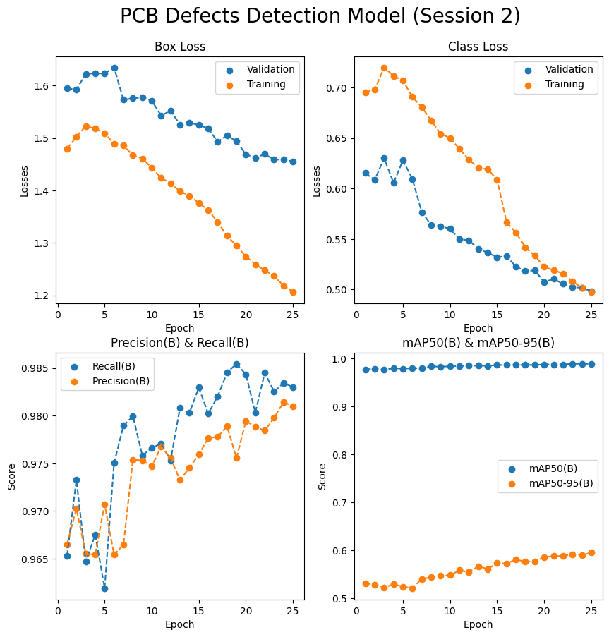

# PCB Defect Detection A.I. Model
- ```PCB Defect Detection A.I. Model``` is a project to help people in electrical/electronic field to check if defects exist in their PCB design / product.  


## Model Results (Latest Session)


## Model Results (history)
 


## Model Result Detail (Latest Session)
|epoch|time   |train/box_loss|train/cls_loss|train/dfl_loss|metrics/precision(B)|metrics/recall(B)|metrics/mAP50(B)|metrics/mAP50-95(B)|val/box_loss|val/cls_loss|val/dfl_loss|lr/pg0     |lr/pg1     |lr/pg2     |
|-----|-------|--------------|--------------|--------------|--------------------|-----------------|----------------|-------------------|------------|------------|------------|-----------|-----------|-----------|
|1    |414.746|1.47949       |0.69539       |1.25265       |0.96649             |0.9653           |0.97714         |0.53104            |1.5943      |0.61521     |1.3973      |0.000332836|0.000332836|0.000332836|
|2    |819.369|1.50226       |0.69788       |1.25738       |0.97026             |0.97326          |0.97909         |0.52831            |1.59243     |0.6084      |1.39252     |0.000639789|0.000639789|0.000639789|
|3    |1219.92|1.52288       |0.71984       |1.27431       |0.96551             |0.96472          |0.97655         |0.52237            |1.62229     |0.62995     |1.41642     |0.000920342|0.000920342|0.000920342|
|4    |1616.52|1.51762       |0.7115        |1.27437       |0.96544             |0.96753          |0.98025         |0.52886            |1.62299     |0.60546     |1.41022     |0.0008812  |0.0008812  |0.0008812  |
|5    |2022.15|1.50918       |0.70676       |1.26727       |0.97071             |0.96191          |0.97877         |0.52419            |1.62297     |0.62786     |1.41326     |0.0008416  |0.0008416  |0.0008416  |
|6    |2427.49|1.48887       |0.6906        |1.26005       |0.96543             |0.97503          |0.98023         |0.52079            |1.63439     |0.60944     |1.42586     |0.000802   |0.000802   |0.000802   |
|7    |2830.86|1.4858        |0.68056       |1.25157       |0.96647             |0.97895          |0.9796          |0.54006            |1.57277     |0.57651     |1.38199     |0.0007624  |0.0007624  |0.0007624  |
|8    |3233.33|1.46705       |0.66734       |1.24283       |0.97539             |0.97996          |0.98379         |0.54354            |1.57549     |0.56378     |1.38134     |0.0007228  |0.0007228  |0.0007228  |
|9    |3632.29|1.46097       |0.65416       |1.24142       |0.97531             |0.97584          |0.98312         |0.54653            |1.57739     |0.56271     |1.38944     |0.0006832  |0.0006832  |0.0006832  |
|10   |4032.96|1.4434        |0.65006       |1.23239       |0.97468             |0.97662          |0.98397         |0.54784            |1.57134     |0.55994     |1.3797      |0.0006436  |0.0006436  |0.0006436  |
|11   |4431.31|1.42396       |0.63912       |1.22752       |0.97676             |0.97708          |0.98496         |0.55817            |1.54252     |0.54973     |1.36085     |0.000604   |0.000604   |0.000604   |
|12   |4829.72|1.41343       |0.62855       |1.21905       |0.97558             |0.97529          |0.98507         |0.55416            |1.55216     |0.54875     |1.36688     |0.0005644  |0.0005644  |0.0005644  |
|13   |5236.12|1.39867       |0.6205        |1.21337       |0.97326             |0.98082          |0.98546         |0.56669            |1.52545     |0.54022     |1.35306     |0.0005248  |0.0005248  |0.0005248  |
|14   |5640.67|1.38954       |0.61919       |1.20346       |0.97452             |0.98029          |0.9849          |0.56064            |1.52937     |0.53635     |1.35556     |0.0004852  |0.0004852  |0.0004852  |
|15   |6042.39|1.37631       |0.60872       |1.20325       |0.97595             |0.98295          |0.98668         |0.57342            |1.52447     |0.53195     |1.35131     |0.0004456  |0.0004456  |0.0004456  |
|16   |6427.33|1.36236       |0.56659       |1.27439       |0.97766             |0.98022          |0.98649         |0.57217            |1.51839     |0.53288     |1.34786     |0.000406   |0.000406   |0.000406   |
|17   |6810.17|1.33981       |0.55632       |1.26049       |0.97779             |0.98202          |0.9872          |0.58076            |1.49267     |0.5227      |1.33411     |0.0003664  |0.0003664  |0.0003664  |
|18   |7196.23|1.31333       |0.54164       |1.24513       |0.97888             |0.98451          |0.98654         |0.57616            |1.5049      |0.51812     |1.34292     |0.0003268  |0.0003268  |0.0003268  |
|19   |7577.51|1.29466       |0.5334        |1.23458       |0.97556             |0.98545          |0.9868          |0.57698            |1.49351     |0.51885     |1.33823     |0.0002872  |0.0002872  |0.0002872  |
|20   |7959.74|1.27423       |0.52239       |1.22324       |0.97944             |0.98434          |0.98754         |0.5855             |1.46888     |0.50737     |1.32394     |0.0002476  |0.0002476  |0.0002476  |
|21   |8344.37|1.25936       |0.51903       |1.21678       |0.97885             |0.98032          |0.98762         |0.58771            |1.4622      |0.51041     |1.32018     |0.000208   |0.000208   |0.000208   |
|22   |8730.42|1.24775       |0.51577       |1.21261       |0.97844             |0.98451          |0.98783         |0.58798            |1.46928     |0.50559     |1.32521     |0.0001684  |0.0001684  |0.0001684  |
|23   |9115.49|1.23672       |0.50798       |1.20514       |0.97978             |0.98252          |0.98918         |0.5915             |1.45871     |0.50209     |1.31927     |0.0001288  |0.0001288  |0.0001288  |
|24   |9498.67|1.21866       |0.5017        |1.1955        |0.98142             |0.98344          |0.98924         |0.59044            |1.45906     |0.50172     |1.32091     |8.92e-05   |8.92e-05   |8.92e-05   |
|25   |9886.73|1.2066        |0.49754       |1.1871        |0.98101             |0.983            |0.98896         |0.59488            |1.45504     |0.49827     |1.31934     |4.96e-05   |4.96e-05   |4.96e-05   |


## Detection Sample
- Missing Hole


- Mouse Bite


- Open Circuit


- Short Circuit


- SPUR


- Spurious Copper


- Mixed Defects


## Live Project

- [Live Project: ```PCB Defect Detector A.I.```](https://mnwanx.github.io/pcb_defect_detector)


## Developer
- Code

### Developer's Personal Social Media:
- [Instagram: ```@MNWANX```](https://instagram.com/mnwanx)
- [TikTok: ```@MNWANX```](https://tiktok.com/@mnwanx)

### GitHub
- [GitHub Page](https://github.com/mnwanx)

### Web Portfolio
- [Portfolio](https://mnwanx.github.io)

### LinkedIn
- [LinkedIn](https://www.linkedin.com/in/mnwanx)
